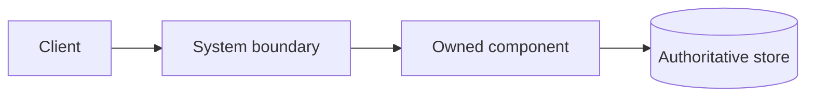
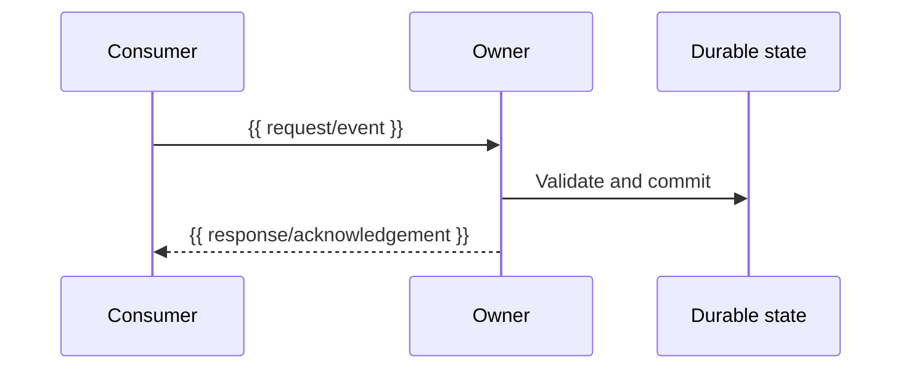

# {{ System name }} System Design

{{ One paragraph on scope, audience, current status, and canonical implementation/source links. }}

**Contents:** [Abstract](#1-abstract) · [Goals and Non-Goals](#2-goals-and-non-goals) · [Background and Problem Statement](#3-background-and-problem-statement) · [Proposed Architecture](#4-proposed-architecture) · [Request Lifecycle](#5-request-lifecycle) · [API and Data Contracts](#6-api-and-data-contracts) · [Consistency, Idempotency, and Replay](#7-consistency-idempotency-and-replay) · [Security and Privacy Considerations](#8-security-and-privacy-considerations) · [Operational Readiness](#9-operational-readiness) · [Alternatives Considered](#10-alternatives-considered) · [Open Questions](#11-open-questions) · [Decision and Next Steps](#12-decision-and-next-steps) · [References and Traceability](#13-references-and-traceability)

## Contents

- [1. Abstract](#1-abstract)
- [2. Goals and Non-Goals](#2-goals-and-non-goals)
- [3. Background and Problem Statement](#3-background-and-problem-statement)
- [4. Proposed Architecture](#4-proposed-architecture)
- [5. Request Lifecycle](#5-request-lifecycle)
- [6. API and Data Contracts](#6-api-and-data-contracts)
- [7. Consistency, Idempotency, and Replay](#7-consistency-idempotency-and-replay)
- [8. Security and Privacy Considerations](#8-security-and-privacy-considerations)
- [9. Operational Readiness](#9-operational-readiness)
- [10. Alternatives Considered](#10-alternatives-considered)
- [11. Open Questions](#11-open-questions)
- [12. Decision and Next Steps](#12-decision-and-next-steps)
- [13. References and Traceability](#13-references-and-traceability)

## 1. Abstract

{{ Problem, outcome, system boundary, workloads, and critical constraints. }}

## 2. Goals and Non-Goals

### Goals

- {{ Measurable in-scope outcome }}

### Non-goals

- {{ Explicit exclusion }}

## 3. Background and Problem Statement

{{ Current state, evidence, requirements, assumptions, and consequences of not addressing the problem. }}

## 4. Proposed Architecture

| Component | Repository/path | Owner | Responsibility |
| --- | --- | --- | --- |
| {{ component }} | {{ path }} | {{ repo/component }} | {{ responsibility }} |

## 5. Request Lifecycle

{{ Include ordering, side effects, retries, timeout, and terminal failure behavior. }}

## 6. API and Data Contracts

| Contract | Kind/version | Owner | Producer | Consumers (repository/component) | Authority |
| --- | --- | --- | --- | --- | --- |
| {{ contract }} | {{ type/version }} | {{ owner }} | {{ producer }} | {{ known consumers or Unknown }} | [{{ source }}]({{ path }}) |

{{ Summarize auth, validation, errors, idempotency, compatibility, and data guarantees. }}

## 7. Consistency, Idempotency, and Replay

| Scenario | Guarantee/recovery | Evidence/source |
| --- | --- | --- |
| {{ duplicate, crash, retry, or replay case }} | {{ behavior }} | {{ path }} |

## 8. Security and Privacy Considerations

{{ Authentication, authorization, secrets, sensitive data, logs, retention, and safe defaults. }}

## 9. Operational Readiness

{{ Build/use prerequisites and link to the detailed runbook. Include probes, dependencies, failure handling, and persistence behavior. }}

### Kubernetes resource budgets

| Pod/workload and container | CPU request | Memory request | CPU limit | Memory limit | Source |
| --- | ---: | ---: | ---: | ---: | --- |
| {{ workload/container }} | {{ value }} | {{ value }} | {{ value }} | {{ value }} | [{{ chart }}]({{ path }}) |

## 10. Alternatives Considered

| Option | Benefits | Costs/risks | Decision |
| --- | --- | --- | --- |
| {{ alternative }} | {{ benefits }} | {{ costs }} | {{ rationale }} |

### Architecture practice fit

- **Clean Architecture:** {{ which policy needs adapter independence, or why no extra layers are useful }}.
- **DDD:** {{ bounded contexts, ownership, invariants, or why a simpler model is enough }}.
- **CQRS:** {{ whether command/query needs justify a projection and how freshness/recovery work, or why they do not }}.
- **YAGNI / KISS / DRY:** {{ what remains intentionally simple, what is deferred, and which shared behavior/contracts have one owner }}.
- **Revisit when:** {{ measurable workload, change, or operational condition }}.

## 11. Open Questions

| Question | Owner | Next step |
| --- | --- | --- |
| {{ unresolved decision }} | {{ role/team }} | {{ action }} |

## 12. Decision and Next Steps

{{ Recommended/approved decision, implementation sequence, and acceptance checks. }}

## 13. References and Traceability

- [Project README]({{ path }})
- [Documentation index]({{ path }})
- [Verification evidence]({{ path }})
- {{ Source/external references }}
